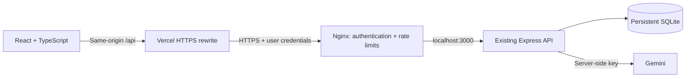

# AI-Assisted Job Tracker

**Next Chapter** is a personal job search workspace built with React, TypeScript,
Express, and SQLite. It organizes applications and interviews, keeps a status
timeline, and uses Gemini to extract job details for review before saving.

## Features

- Create, search, filter, sort, edit, and delete job applications.
- Track six application statuses with timestamped history and optional notes.
- Manage interview rounds, custom types, local appointment times, outcomes, and notes.
- Extract company, role, and skills from a job description with AI; review and edit before saving.
- Handle empty, loading, error, retry, and deletion confirmation states.
- Responsive desktop and mobile layouts, keyboard-accessible dialogs, and direct application links.
- Personal-workspace sign-in when deployed behind the included Nginx configuration.

Skills are an extraction preview only. The original description, company, role,
and application status are saved. Interview status does not automatically change
application status. Deletion is permanent; `withdrawn` preserves history.

## Architecture



Local development uses Vite's `/api` proxy. The API continues to listen on
literal `localhost`. The frontend contains no Gemini credentials, and deployment
requires HTTPS and access protection before making the API public.

## Local development

Use Node 24, as specified in `.nvmrc`. Run these commands from the repository root:

```bash
nvm use
npm ci --prefix backend
npm ci --prefix frontend
```

Start the backend in one terminal:

```bash
cd backend
npm run dev
```

Start the frontend in another terminal, from the repository root:

```bash
cd frontend
npm run dev
```

Open the Vite URL, normally `http://localhost:5173`. The default backend target
is `http://localhost:3000`. If needed, set `API_PROXY_TARGET` when starting Vite.
Keep backend secrets in the existing backend environment; do not copy them into
the frontend. Manual application management works without a Gemini key.

For a development session without reading any `.env` file:

```bash
cd backend
DOTENV_CONFIG_PATH=/dev/null DATABASE_PATH=:memory: npm run dev
```

This mode loses its data on restart, and real AI extraction is unavailable.

## Verification

```bash
cd backend
npm run typecheck
DOTENV_CONFIG_PATH=/dev/null npm test
```

From a separate terminal at the repository root:

```bash
cd frontend
npm run typecheck
npm run lint
npm run test:config
npm run build
npx playwright install chromium
npm test
```

Frontend E2E tests run Chromium against the real Express API with an isolated
in-memory database on port 3101 and Vite on port 5174. AI and production-auth
responses are mocked in the browser; tests make no real Gemini calls. Backend
tests use their own in-memory server on port 3100. Test services never reuse an
existing server. CI runs backend and frontend checks independently.

## Deployment

See [the deployment guide](docs/DEPLOYMENT.md) for the Vercel + EC2 + Nginx setup,
TLS, sign-in, persistence, backups, verification, and rollback. Infrastructure
has not been provisioned by these files.

`frontend/vercel.json` initially points to a deliberately invalid hostname.
Vercel builds fail until the real HTTPS API origin is configured:

```bash
cd frontend
npm run configure:deploy -- https://your-real-api-domain
```

Set the Vercel project root to `frontend`. User credentials are held only in
memory, so reloading the page requires signing in again. This is a single-user
MVP, not a multi-tenant authentication system. There is no public demo account.

## API summary

| Method | Path | Purpose |
| --- | --- | --- |
| GET | `/health` | Health check |
| GET / POST | `/jobs` | List / create applications |
| GET / PATCH / DELETE | `/jobs/:id` | Detail / edit / permanently delete |
| PATCH | `/jobs/:id/status` | Change status and append history |
| GET / POST | `/jobs/:id/interviews` | List / create interviews |
| PATCH / DELETE | `/interviews/:id` | Edit / delete an interview |
| POST | `/ai/parse-job` | Extract company, title, and skills without saving |

Invalid requests normally return 400; missing records return 404. An unchanged
application status returns 409. Successful deletes return 204 with no body.
AI timeout returns 504; other AI failures return 502.

## Project structure

```text
backend/                 Existing Express API, SQLite repositories, API tests
frontend/src/            React workspace, forms, typed API client, styles
frontend/tests/          Browser workflow tests
frontend/scripts/        Vercel configuration and validation
deploy/                  Nginx, systemd, environment template, SQLite backup
docs/DEPLOYMENT.md        Guided deployment and operations
.github/workflows/       Backend and frontend CI
```
